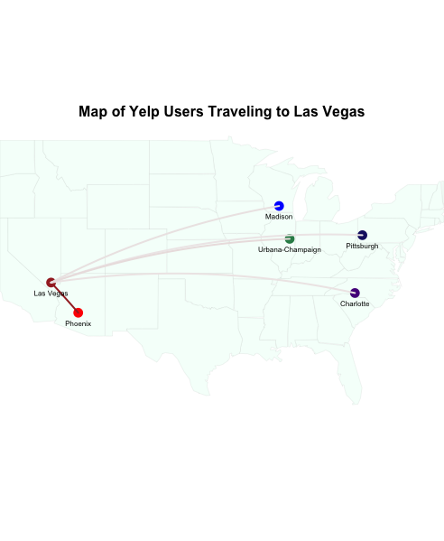
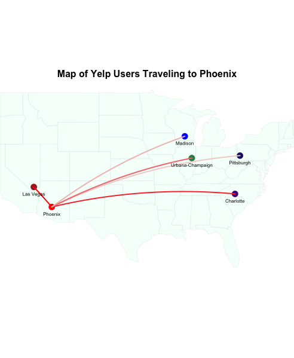
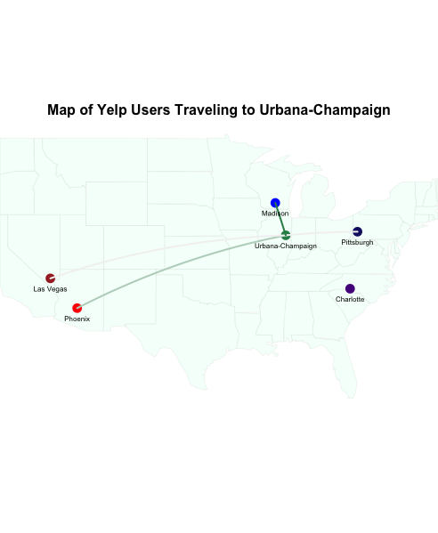
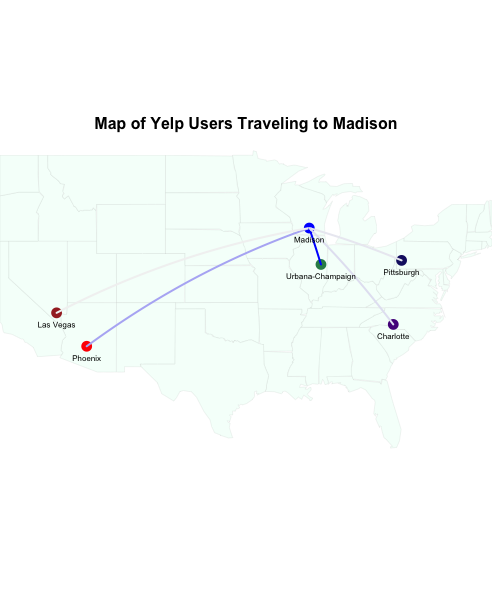
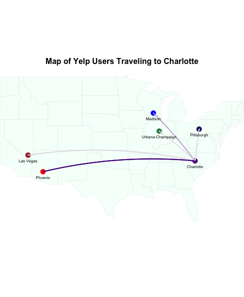
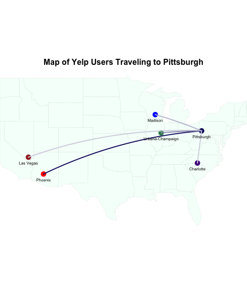

```{r, warning= FALSE, echo=FALSE, message=FALSE}
library(RJSONIO)
library(dplyr)
library(tidyr)
library(readr)
library(glmnet)
library(ggplot2)
library(caret)
library(ggmap)
library(maps)
library(leaflet)
library(geosphere)
library(randomForest)
library(stringr)
library(doMC)
library(class)
setwd("~/Documents/HSPH Spring 2016/BIO 260 Data Science/FinalProject/BIO260_Project")
```

We first want to load the datasets for businesses, users and reviews.

##### Businesses
```{r}
#load businesses
lines <- readLines("yelp_academic_dataset_business.json") 
business_full <- lapply(lines, fromJSON)
rm(lines)
business_full <- data.frame(do.call('rbind', business_full))
business_full <- business_full %>% 
  mutate(state = as.character(state), business_id = as.character(business_id))
```

The naming of the city in the dataset is at the postal code level. We want to make the grouping at the metropolitan level so that we can classify tourists vs. locals. We use the grouping that yelp provided. 

```{r, eval=FALSE, warning= FALSE, message=FALSE}
unique(business_full$state)
#some states seem to be misclassified
View(filter(business_full, state == "NM")[1:10,]) # Las Vegas in NM, remove 
View(filter(business_full, state == "TX")[1:10,]) # Dallas in Texas, remove 
View(filter(business_full, state == "EDH")[1:10,]) # EDH is Edinburgh 
View(filter(business_full, state == "MLN")[1:10,]) # MLN is Edinburgh
View(filter(business_full, state == "FIF")[1:10,]) # close to Edinburgh, classify as Edinburgh
View(filter(business_full, state == "ELN")[1:10,]) # close to Edinburgh, classify as Edinburgh
View(filter(business_full, state == "BW")[1:10,]) # Karlsruhe
View(filter(business_full, state == "RP")[1:10,]) # Karlsruhe
View(filter(business_full, state == "KHL")[1:10,]) # Edinburgh
View(filter(business_full, state == "NW")[1:10,]) # Karlsruhe
```

```{r, warning= FALSE, message=FALSE}
#group businesses by cities listed in yelp dataset
yelp_city <- matrix(c("PA", "Pittsburgh", 
                      "NC", "Charlotte", 
                      "SC", "Charlotte", 
                      "WI", "Madison", 
                      "IL", "Urbana-Champaign", 
                      "AZ", "Phoenix", 
                      "NV", "Las Vegas", 
                      "QC", "Montreal", 
                      "ON", "Waterloo", 
                      "EDH", "Edinburgh" ,
                      "MLN", "Edinburgh", 
                      "ELN", "Edinburgh", 
                      "BW", "Karlsruhe", 
                      "RP", "Karlsruhe"), 
                    ncol = 2, byrow = TRUE)
colnames(yelp_city) <- c("state", "yelp_city")
yelp_city <- data.frame(yelp_city)
#join with business
business_full <- left_join(business_full, yelp_city, by = "state")
business_full <- business_full %>%
  filter(!is.na(yelp_city)) %>%
  mutate(state = as.character(state))
#some businesses are in more than one category
#unpack the categories for each business
business_categories <- cbind(unlist(rep(business_full$business_id,lapply(business_full$categories,length))),
                             unlist(business_full$categories))
colnames(business_categories) <- c("business_id", "category")
business_categories <- data.frame(business_categories)
#spread to get one row per business with columns for each category
#this series of code will turn the dataset into wide format with categories as a logical variable
business_categories_wide <- data.frame(business_categories, 1)
business_categories_wide <- business_categories_wide %>% spread(category, X1)
business_categories_wide[is.na(business_categories_wide)] <- 0
#write.csv(business_categories, file = "business_categories.csv")
#get the categories as a list
cats <- data.frame(unlist(business_full$categories))
colnames(cats) <- c("categories")
#count how many times each category appears
#arrange by count
cats <- cats %>%
  group_by(categories) %>%
  summarise(n = n()) %>%
  ungroup %>%
  arrange(desc(n))
#pick the first 100 categories
high_cats <- cats$categories[1:100]
high_cats <- as.character(high_cats)
#join with business data frame
business_wide <-  select(business_full, business_id, yelp_city) %>%
  left_join(select(business_categories_wide, business_id, one_of(high_cats)))
```

##### Users
We first convert the users dataset into a .csv file. This allows the file to load faster for subsequent uses.
```{r, eval=FALSE, warning= FALSE, message=FALSE}
lines <- readLines("yelp_academic_dataset_user.json") 
users_full <- lapply(lines, fromJSON)
rm(lines)
users_full <- data.frame(do.call('rbind', users_full))
users_full <- apply(users_full, 2, as.character)
users_full <- data.frame(users_full)
write.csv(users_full, file = "users_full.csv")
```

```{r}
#load users
users <- read_csv("users_full.csv")
```

##### Reviews

We had to set up the reviews dataset to convert to .csv in several steps because it was too large.

```{r, eval=FALSE, warning= FALSE, message=FALSE}
chunky <- function(lines,file_name) {
  jsoned <- lapply(lines, fromJSON)
  df <- data.frame(do.call('rbind',jsoned))
  df <- df[,-c(1,7)]
  df$user_id <- as.character(df$user_id)
  df$review_id <- as.character(df$review_id)
  df$stars <- as.numeric(df$stars)
  df$date <- as.character(df$date)
  df$text <- as.character(df$text)
  df$business_id <- as.character(df$business_id)
  write_csv(df,file_name)
  return("done!")
}

chunk_wrapper <- function(lines) {
  n <- length(lines)
  for(i in 1:ceiling(n/250000)) {
    start_row <- 1+(i-1)*250000
    end_row <- i*250000
    if(i==ceiling(n/250000)) { end_row = n}
    chunky(lines[start_row:end_row],paste0("reviews_",start_row,"_",end_row,".csv"))
  }
  return("really done!")
}
#combine the files to get reviews.csv

reviews_full <- read_csv("reviews_full.csv")
write.csv(reviews, file = "reviews_notext.csv")

```

```{r}
#load reviews dataset
reviews <- read_csv("reviews_notext.csv")[-1]
```

### Predicting Tourists vs. Locals
Our dataset does not have the information regarding the home city of each user. In this section, we attempt to make a classification of tourist vs. local for each user-city combination using some of the information we have. 

To this end, we create some variable for each user such as number of places reviewed in each city (locals have more reviews in their home city), standard deviation (locals will have reviewed places in their home city over a longer period of time) and the number of reviews in each category for each user (some categories like "Home Services" might be reviewed more by locals).

##### Join Reviews, Businesses and Users and Create Variables
```{r}
#join reviews and businesses
joined <- left_join(select(reviews, user_id, business_id, date), business_wide, by = "business_id")
#add number of categories reviewed in each city by each user
sum_categories <- select(joined, -business_id, -date) %>%
  group_by(user_id, yelp_city) %>%
  summarize_each(funs(sum)) %>% 
  ungroup
#get the number of places reviewed in each city and the standard deviation of the dates
joined <- select(joined, user_id, yelp_city, date) %>%
  left_join(select(users, user_id, review_count)) %>%
  group_by(user_id, yelp_city) %>%
  summarize(review_city = n(), sd_dates = sd(as.Date(date)))
#join to the table with summed categories
joined <- left_join(joined, sum_categories)
#join to users table
joined <- joined %>%
  left_join(select(users, user_id, review_count)) %>%
  ungroup
#reorder columns and rename review_count for users 
joined <- joined[,c(1:3, 105, 4:104)]
colnames(joined)[4] <- "review_total"
#set SD dates that are NA's to 0
joined$sd_dates[is.na(joined$sd_dates)] <- 0
#remove users that have 10 or less reviews
grouped_users <- joined %>% filter(review_total > 10)
#check if there are still users that have only reviewed in one city
grouped_users %>% ungroup %>%summarise(n = sum(review_city == review_total))
#remove users that have only reviewed in one city
#because they will have 100% of their reviews one city but this doesn't help with classifying them
grouped_users <- grouped_users %>%
  ungroup %>%
  filter(review_city != review_total)
#create columns that convert number of reviews into proportions
grouped_users <- grouped_users %>% 
  mutate(percent_city = review_city/review_total) %>% na.omit
```

Now, we will assign some of the users that we can be fairly certain are tourist or locals as such and build a regression model to eventually apply the model to the rest of the dataset.

To assign tourist/local designation to users, we use a conservative threshold for what percent of their total reviews would need to be in a particular city for them to be considered a tourist or a local in that city. We set 0.1 as the threshold for being a tourist i.e. users would need to have done 10% or less of their reviews in a city to be considered tourists in that city. And we set 0.8 as the threshold for being a local i.e. users would need to have done 80% or more of their reviews in a city to be considered locals in that city.

```{r}
#create tourist vs local column
grouped_users <- grouped_users %>% 
  mutate(tourist = ifelse(percent_city < 0.1, 1, ifelse(percent_city > 0.8, 0, NA)))
#keep only the ones that have been classified as tourists or locals
grouped_users_tl <- grouped_users %>% filter(!is.na(tourist))
grouped_users_tl %>% group_by(tourist) %>% summarise(num = n(), review_count = mean(review_total), 
                                                     city_count = mean(review_city))
```

We fit a logistic regression model with and without a LASSO penalty. We want to check if the LASSO penalty would prevent the model from overfitting to the training set by regularizing the contributions of some of the parameters.

##### Logistic Regression
```{r}
set.seed(202)
#create train and test dataset
inTrain <- createDataPartition(y = grouped_users_tl$tourist, p=0.5)
train_set_tl <- slice(select(grouped_users_tl, -user_id, -yelp_city, -review_city, -review_total, -percent_city),
                   inTrain$Resample1)
test_set_tl <- slice(select(grouped_users_tl, -user_id, -yelp_city, -review_city, -review_total, -percent_city),
                  -inTrain$Resample1)
#run glm model
glm.tourist <- glm(tourist ~ ., family = binomial, data = train_set_tl)
summary(glm.tourist)
#test accuracy on train and test set
glm_train_prob <- round(predict(glm.tourist, train_set_tl, type = "response"))
glm_test_prob <- round(predict(glm.tourist, test_set_tl, type = "response"))
#Confusion Matrix for train set
tab <- table(glm_train_prob, train_set_tl$tourist)
conf_matrix <- confusionMatrix(tab)
conf_matrix$table
conf_matrix$overall["Accuracy"]
#Confusion Matrix for test set
tab <- table(glm_test_prob, test_set_tl$tourist)
conf_matrix <- confusionMatrix(tab)
conf_matrix$table
conf_matrix$overall["Accuracy"]
```

##### LASSO
```{r}
#glmnet needs covariates in a matrix form
x_train <- as.matrix(train_set_tl %>% select(-tourist)) 
x_test <-as.matrix(test_set_tl %>% select(-tourist)) 
#run LASSO without tuning
tourist.lasso <-glmnet(x_train, y = as.factor(train_set_tl$tourist),alpha=1,family='binomial')
plot(tourist.lasso,xvar="lambda")
title(main = "Coefficients at different Log Lambda", cex.main = 1, line = 3)
#use cross validation to find optimal value of lambda (penalty parameter)
cv.lasso <- cv.glmnet(x_train, y=train_set_tl$tourist, alpha=1)
plot(cv.lasso)
title( main = "CV MSE vs Log Lambda", cex.main = 1, line = 3)
best_lambda_l <- cv.lasso$lambda.min
#run LASSO with the best_lambda
tourist.lasso_best<- glmnet(x_train, as.factor(train_set_tl$tourist),
                    alpha=1,family='binomial', lambda = best_lambda_l)
tourist.lasso_best$beta

#test accuracy on train and test set
lasso_train_prob <- round(predict(tourist.lasso_best, x_train, type = "response"))
lasso_test_prob <- round(predict(tourist.lasso_best, x_test, type = "response"))

#Confusion Matrix for train set
tab <- table(lasso_train_prob, train_set_tl$tourist)
conf_matrix <- confusionMatrix(tab)
conf_matrix$table
conf_matrix$overall["Accuracy"]
#Confusion Matrix for test set
tab <- table(lasso_test_prob, test_set_tl$tourist)
conf_matrix <- confusionMatrix(tab)
conf_matrix$table
conf_matrix$overall["Accuracy"]
```

The accuracies are similar for the two methods and the LASSO shrinks most of the coefficients that were non-significant from the GLM.
We decided to got with the GLM model without the LASSO penalty based on the slightly higher accuracy in the test dataset.

To make prediction on the full dataset, we use conservative thresholds on the results of the regression as well. We decided to only classify as tourists if the predicted probability of being a tourist is greater than 0.6 and classify as locals if the predicted probability is less than 0.4.

##### Predictions on Full Dataset
```{r}
#apply logistic regression model to the full dataset
grouped_users_pred <- grouped_users %>%   
  mutate(pred_tourist_prob = predict(glm.tourist, grouped_users, type = "response"))
#classify as tourist, local or unsure (if between 0.4 and 0.6)
grouped_users_pred <- grouped_users_pred %>%   
  mutate(pred_tourist = ifelse(pred_tourist_prob > 0.6, "tourist", 
                               ifelse(pred_tourist_prob <0.4, "local", "unsure")))
#"Confusion Matrix"
grouped_users_pred %>% 
  filter(!is.na(pred_tourist)) %>%
  mutate(tourist = ifelse(tourist == 1, "tourist", 
                          ifelse(tourist == 0, "local", NA))) %>%
  filter(!is.na(tourist)) %>%
  group_by(tourist) %>%
  summarise(Correct = sum(tourist == pred_tourist),
            Incorrect= sum(tourist != pred_tourist))
#check percent of reviews in the city and the total number of reviews for users in each category
grouped_users_pred %>% group_by(pred_tourist) %>% summarise(percent_city = mean(percent_city),
                                                            review_total = mean(review_total))
```

##### Caveats of the Tourist Classification Model

This model is based on a forced initial classification (based on <0.1, >0.8 thresholds) and while it can be justified and our thresholds were pretty conservative, there might be several issues because we do not have a way of verifying our thresholds.

For instance, our initial classification might be affected by the number of total reviews for each user. We see here that most people classified as tourists are the ones that generally have more total reviews. Some of them might be frequent travelers and they might review in their home cities just as often as their travel cities. 

Also, from our confusion matrices, we can see that our models are skewed by the tourists since we have a lot more tourists than locals in our dataset (tourists can be from any part of the world, locals need to be from one of the 10 cities in the dataset). So although the model seems to have a high accuracy overall, the error is much larger among the locals. 

We ran some spot checks to see how well the model did by reading some of the actual reviews in Montreal and Las Vegas.

```{r, eval=FALSE, warning= FALSE, message=FALSE}
#montreal locals and tourists
montreal_local <- grouped_users_pred %>% filter(yelp_city == "Montreal" & pred_tourist == "local") 
montreal_tourist <- grouped_users_pred %>% filter(yelp_city == "Montreal" & pred_tourist == "tourist") 

vegas_local <- grouped_users_pred %>% filter(yelp_city == "Las Vegas" & pred_tourist == "local") 
vegas_tourist <- grouped_users_pred %>% filter(yelp_city == "Las Vegas" & pred_tourist == "tourist") 
```

```{r,eval=FALSE, warning= FALSE, message=FALSE}
#MONTREAL LOCALS
smpl  <- sample(seq(1, nrow(montreal_local), 1), 10)

test_reviews <- left_join(reviews[reviews_full$user_id==montreal_local$user_id[smpl[1]],],select(business,yelp_city,
                                                                                            business_id))
#can't tell, in French

test_reviews <- left_join(reviews[reviews_full$user_id==montreal_local$user_id[smpl[2]],],select(business,yelp_city,
                                                                                            business_id))
#might be local

test_reviews <- left_join(reviews[reviews_full$user_id==montreal_local$user_id[smpl[3]],],select(business,yelp_city,
                                                                                            business_id))
#probably local

test_reviews <- left_join(reviews[reviews_full$user_id==montreal_local$user_id[smpl[4]],],select(business,yelp_city,
                                                                                            business_id))
#probably local

test_reviews <- left_join(reviews[reviews_full$user_id==montreal_local$user_id[smpl[5]],],select(business,yelp_city,
                                                                                            business_id))
#local

test_reviews <- left_join(reviews[reviews_full$user_id==montreal_local$user_id[smpl[6]],],select(business,yelp_city,
                                                                                            business_id))
#French

test_reviews <- left_join(reviews[reviews_full$user_id==montreal_local$user_id[smpl[7]],],select(business,yelp_city,
                                                                                            business_id))
#French, probably local
```

```{r,eval=FALSE, warning= FALSE, message=FALSE}
#MONTEREAL TOURISTS
smpl  <- sample(seq(1, nrow(montreal_tourist), 1), 10)

test_reviews <- left_join(reviews[reviews_full$user_id==montreal_tourist$user_id[smpl[1]],],select(business,yelp_city,
                                                                                              business_id))
#incorrect

test_reviews <- left_join(reviews[reviews_full$user_id==montreal_tourist$user_id[smpl[2]],],select(business,yelp_city,
                                                                                              business_id))
#correct

test_reviews <- left_join(reviews[reviews_full$user_id==montreal_tourist$user_id[smpl[3]],],select(business,yelp_city,
                                                                                              business_id))
#probably correct

test_reviews <- left_join(reviews[reviews_full$user_id==montreal_tourist$user_id[smpl[4]],],select(business,yelp_city,
                                                                                              business_id))
#correct

test_reviews <- left_join(reviews[reviews_full$user_id==montreal_tourist$user_id[smpl[5]],],select(business,yelp_city,
                                                                                              business_id))
#seems correct, local in Champagne, frequently visits Montreal userID CX4GcrCCnzfNyAl0cPqGbg

test_reviews <- left_join(reviews[reviews_full$user_id==montreal_tourist$user_id[smpl[6]],],select(business,yelp_city,
                                                                                              business_id))
#correct
```

```{r,eval=FALSE, warning= FALSE, message=FALSE}
#VEGAS LOCALS
smpl  <- sample(seq(1, nrow(vegas_local), 1), 10)

test_reviews <- left_join(reviews[reviews_full$user_id==vegas_local$user_id[smpl[1]],],select(business,yelp_city,
                                                                                         business_id))
#correct

test_reviews <- left_join(reviews[reviews_full$user_id==vegas_local$user_id[smpl[2]],],select(business,yelp_city,
                                                                                         business_id))
#seems correct

test_reviews <- left_join(reviews[reviews_full$user_id==vegas_local$user_id[smpl[3]],],select(business,yelp_city,
                                                                                         business_id))
#correct

test_reviews <- left_join(reviews[reviews_full$user_id==vegas_local$user_id[smpl[4]],],select(business,yelp_city,
                                                                                         business_id))
#correct

test_reviews <- left_join(reviews[reviews_full$user_id==vegas_local$user_id[smpl[5]],],select(business,yelp_city,
                                                                                         business_id))
#correct
```

```{r,eval=FALSE, warning= FALSE, message=FALSE}
#VEGAS TOURISTS
smpl  <- sample(seq(1, nrow(vegas_tourist), 1), 10)

test_reviews <- left_join(reviews[reviews_full$user_id==vegas_tourist$user_id[smpl[1]],],select(business,yelp_city,
                                                                                         business_id))
#correct

test_reviews <- left_join(reviews[reviews_full$user_id==vegas_tourist$user_id[smpl[2]],],select(business,yelp_city,
                                                                                         business_id))
#seems correct

test_reviews <- left_join(reviews[reviews_full$user_id==vegas_tourist$user_id[smpl[3]],],select(business,yelp_city,
                                                                                         business_id))
#correct

test_reviews <- left_join(reviews[reviews_full$user_id==vegas_tourist$user_id[smpl[4]],],select(business,yelp_city,
                                                                                         business_id))
#correct, review in German

test_reviews <- left_join(reviews[reviews_full$user_id==vegas_tourist$user_id[smpl[5]],],select(business,yelp_city,
                                                                                         business_id))
#seems incorrect

test_reviews <- left_join(reviews[reviews_full$user_id==vegas_tourist$user_id[smpl[6]],],select(business,yelp_city,
                                                                                         business_id))
#seems incorrect

test_reviews <- left_join(reviews[reviews_full$user_id==vegas_tourist$user_id[smpl[7]],],select(business,yelp_city,
                                                                                         business_id))
#seems correct
```

##### Filtering Users that are Classified as Local/Tourist in at least one city each
```{r}
#save users that have been classified
users_trstvsloc <- grouped_users_pred %>% select(user_id, yelp_city, pred_tourist)
#write.csv(users_trstvsloc, file = "user_touristvlocal.csv")
#long format with cities as columns
users_trstvsloc_spread <- users_trstvsloc %>% spread(yelp_city, pred_tourist)
#write.csv(users_trstvsloc_spread, file = "user_touristvlocal_spread.csv")
#select users that have been classified as local in at least one city and tourist in at least one
yc_locals_trst <- users_trstvsloc %>% 
  group_by(user_id) %>%
  mutate(n=n()) %>%
  ungroup %>%
  filter(n>1) %>%
  filter(pred_tourist == "local")
#some users are locals in more than 1 city
twice_locals <- yc_locals_trst %>% group_by(user_id) %>% summarise(n = n()) %>% filter(n>1)
#check how many cities they've been classified in 
twice_locals <- users_trstvsloc %>%
  filter(user_id %in% twice_locals$user_id) %>% 
  group_by(user_id) %>% mutate(n = n()) %>% unique
#people that are not classified as tourists anywhere
twice_locals_only <- unique(filter(twice_locals, n<3)$user_id)
#filter out people that are not classified as tourists anywhere
yc_locals_trst <- yc_locals_trst %>% filter(!(user_id %in% twice_locals_only))
#wide version of the same data with cities as columns
locals_tourist <- right_join(users_trstvsloc_spread, select(yc_locals_trst, user_id))
```

This will be the dataset we will use to build our model and make prediction because we have information on the users' home city and travel city preferences.

### Predicting Ratings on Yelp for Tourists
We will now build our model to make predictions for yelpers.

##### Business Effect
Business effect is the average stars the business receives from the reviews in our dataset.
```{r, eval=FALSE, warning= FALSE, message=FALSE}
#filter just the dining businesses
business_food <- business_full %>%
  filter(grepl("Restaurants", as.character(categories)) | 
           grepl("Cafe", as.character(categories)))

set_users <- unique(yc_locals_trst$user_id)
mu <- mean(reviews %>% filter(!(user_id %in% set_users)) %>% .$stars)
business2 <- reviews %>% filter(!(user_id %in% set_users)) %>% group_by(business_id)  %>%  
  summarise(business_stars = mean(stars),b_n=n()) %>%
  left_join(select(business_food, business_id, yelp_city, attributes),
            select(.,business_id,business_stars,b_n),by="business_id")
  
```

##### Tourist Effect
Tourist effect is the average of the stars for reviews by a tourist for each business.
```{r, eval=FALSE, warning= FALSE, message=FALSE}
business2 <- reviews %>% 
  filter(!(user_id %in% set_users)) %>%  
  left_join(select(business2,business_id,yelp_city))%>% 
  left_join(users_trstvsloc,by=c("user_id","yelp_city"))%>% 
  filter(pred_tourist=="tourist") %>% group_by(business_id) %>% 
  summarise(tourist_stars = mean(stars),t_n=n()) %>% 
  left_join(business2,select(.,business_id,tourist_i, t_n),by="business_id")
#if there weren't any tourists who reviewed the place, set the tourist stars equal to the mean for the business
business2$tourist_stars[is.na(business2$tourist_stars)] <- business2$business_stars[is.na(business2$tourist_stars)]
```

##### User Local Effects
This is the average ratings for users in their home city.
```{r, eval=FALSE, warning= FALSE, message=FALSE}
user_effects <- select(reviews,review_id,user_id,business_id,stars) %>% 
  filter(user_id %in% set_users) %>% 
  left_join(select(business2,business_id,yelp_city)) %>% 
  left_join(users_trstvsloc,by=c("user_id","yelp_city")) %>% 
  filter(pred_tourist=="local") %>% 
  group_by(user_id) %>% 
  summarise(user_local_stars = mean(stars),user_local_n=n())
```

##### User Local Ratings by business category
This is the average ratings for users by business category in their home city.
```{r, eval=FALSE, warning= FALSE, message=FALSE}
#The user category effect takes the average ratings for each category attribute from the user's home city and connects these averages to the category attributes of the business in the review that is being predicted.
user_categories <- select(reviews,review_id,user_id,business_id,stars) %>% 
  filter(user_id %in% set_users) %>% 
  left_join(select(business2,business_id,yelp_city)) %>% 
  left_join(users_trstvsloc,by=c("user_id","yelp_city")) %>%  
  filter(pred_tourist=="local") %>%  
  inner_join(business_categories,.) %>% 
  filter(!(category %in% c("Restaurants","Cafe","Food"))) %>% 
  group_by(user_id,category) %>% 
  summarise(user_category_stars = mean(stars),user_cat_n=n())
```

##### User Local Ratings by business attributes
This is the average ratings for users by business attributes in their home city.
```{r, eval=FALSE, warning= FALSE, message=FALSE}
#make function to make table where each attribute for a business gets a new row
make_attributes <- function(df) {
  return_df <- NULL
  for(i in 1:nrow(df)) {
    atr_i <- unlist(df$attributes[i])
    if(!is.null(atr_i)) {return_df <- rbind(return_df,cbind(df$business_id[i],names(atr_i),matrix(atr_i)))}
  }
  return_df <- data.frame(return_df)
  names(return_df) <- c("business_id","attribute","value")
  return(return_df)
}

#make each attribute for a business get a new row for the businesses reviewed by the users that have been selected
business_att <- select(reviews, -text) %>%
  filter(user_id %in% set_users) %>%
  left_join(select(business2, business_id, attributes)) %>%
  select(business_id, attributes) %>%
  make_attributes
write.csv(business_att, file = "business_att.csv")
business_attributes <- read.csv("business_att.csv")
business_attributes <- business_attributes %>% filter(value != FALSE)
```

```{r, eval=FALSE, warning= FALSE, message=FALSE}
#compute the average for each business attribute by user
user_attributes <- select(reviews,review_id,user_id,business_id,stars) %>% 
  filter(user_id %in% set_users) %>% 
  left_join(select(business2,business_id,yelp_city)) %>% 
  left_join(users_trstvsloc,by=c("user_id","yelp_city")) %>%  
  filter(pred_tourist=="local") %>%  
  inner_join(business_attributes,.) %>% 
  group_by(user_id,attribute,value) %>% 
  summarise(user_attribute_stars = mean(stars),user_at_n=n())
```

##### User Ratings by business attribute (ambience)
```{r, eval=FALSE, warning= FALSE, message=FALSE}
#The user ambience effect takes the average ratings for each ambience attribute from the user's home city and connects these averages to the ambience attributes of the business in the review that is being predicted.
business_ambience <- select(business_attributes,-value) %>% filter(grepl("Ambience",attribute))
user_ambience <- select(user_attributes,-value) %>% filter(grepl("Ambience",attribute))

ambience_reviews  <- reviews %>%
  select(.,review_id,user_id,business_id,stars) %>%
  filter(user_id %in% set_users) %>%
  inner_join(business_ambience,.,by="business_id") %>%
  left_join(.,user_ambience, by=c("user_id","attribute")) %>%
  mutate(user_ambience_stars = ifelse(is.na(user_attribute_stars),0,user_attribute_stars),
         user_ambience_n = ifelse(is.na(user_at_n),0,user_at_n)) %>%
  group_by(review_id) %>%
  summarise(user_ambience_stars=mean(user_ambience_stars),user_ambience_n=sum(user_ambience_n))
```


##### User Ratings by business attribute ("good for")
```{r, eval=FALSE, warning= FALSE, message=FALSE}
#The user 'good for' effect takes the average ratings for each 'good for' attribute from the user's home city and connects these averages to the 'good for' attributes of the business in the review that is being predicted.
user_good_for <- select(user_attributes,-value) %>% filter(grepl("Good For",attribute))
business_good_for <- select(business_attributes,-value) %>% filter(grepl("Good For",attribute))

good_for_reviews  <- reviews %>%
  select(.,review_id,user_id,business_id,stars) %>%
  filter(user_id %in% set_users) %>%
  inner_join(business_good_for,.,by="business_id") %>%
  left_join(.,user_good_for, by=c("user_id","attribute")) %>%
  mutate(user_good_for_stars = ifelse(is.na(user_attribute_stars),0,user_attribute_stars),
         user_good_for_n = ifelse(is.na(user_at_n),0,user_at_n)) %>%
  group_by(review_id) %>%
  summarise(user_good_for_stars=mean(user_good_for_stars),user_good_for_n=sum(user_good_for_n))
```

##### Price Range reviews
```{r, eval=FALSE, warning= FALSE, message=FALSE}
#The user price range effect takes the average ratings for each price range attribute from the user's home city and connects these averages to the price range attributes of the business in the review that is being predicted.
user_price <- user_attributes %>%
  rename(price_range=value) %>%
  filter(grepl("Price Range",attribute)) %>%
  select(.,-attribute) 

business_price_ranges <- business_attributes %>% 
  filter(grepl("Price Range",attribute)) %>% 
  select(business_id,value) %>% 
  rename(price_range=value)

price_range_reviews <- reviews %>%
  select(.,review_id,user_id,business_id,stars) %>%
  filter(user_id %in% set_users) %>%
  left_join(.,business_price_ranges) %>%
  left_join(.,user_price, by=c("user_id","price_range")) %>%
  mutate(user_price_stars = ifelse(is.na(user_attribute_stars),0,user_attribute_stars),
         user_price_n = ifelse(is.na(user_at_n),0,user_at_n)) %>%
  group_by(review_id) %>%
  summarise(user_price_stars=mean(user_price_stars), user_price_n=mean(user_price_n))

```

##### Join all the variables created so far to the review dataset
```{r, eval=FALSE, warning= FALSE, message=FALSE}
#First join eveything except the attribute effects
category_reviews <- reviews %>%
  select(.,review_id,user_id,business_id,stars) %>%
  filter(user_id %in% set_users) %>%
  left_join(.,select(business2,business_id,tourist_stars,t_n,business_stars,b_n,yelp_city)) %>%
  left_join(.,users_trstvsloc,by=c("user_id","yelp_city")) %>%  filter(pred_tourist=="tourist") %>%
  left_join(.,select(user_effects,user_id,user_local_stars,user_local_n)) %>%
  inner_join(business_categories,.,by="business_id") %>%
  filter(!(category %in% c("Restaurants","Cafe","Food"))) %>%
  left_join(.,user_categories,by="category") %>%
  mutate(user_category_stars = ifelse(is.na(user_category_stars),0,user_category_stars),
         user_cat_n = ifelse(is.na(user_cat_n),0,user_cat_n)) %>%
  group_by(review_id,business_id) %>%
  summarise(stars=mean(stars),
            user_local_stars=mean(user_local_stars),
            user_local_n=mean(user_local_n),
            tourist_stars=mean(tourist_stars),
            t_n=mean(t_n),
            business_stars=mean(business_stars),
            b_n=mean(b_n),
            user_category_stars=mean(user_category_stars),
            user_cat_n=sum(user_cat_n)) 
write.csv(category_reviews, file = "category_reviews.csv")

category_reviews <- read.csv("category_reviews.csv")[-1]

#Now add attributes
review_set <- unique(category_reviews$review_id)
dat <- left_join(category_reviews,ambience_reviews %>% filter(review_id %in% review_set))
dat <- left_join(dat,good_for_reviews %>% filter(review_id %in% review_set))
dat <- left_join(dat,price_range_reviews %>% filter(review_id %in% review_set))

dat <- left_join(dat,select(business_full,business_id,yelp_city))
dat <- left_join(dat,select(reviews,review_id,user_id))
dat <- left_join(dat,select(yc_locals_trst,user_id,yelp_city), by="user_id")
dat <- rename(dat, business_city = yelp_city.x)
dat <- rename(dat, user_city = yelp_city.y)


dat <- dat %>%
  mutate(business_stars = ifelse(is.na(business_stars),mu,business_stars)) %>%
  mutate(user_local_stars = ifelse(is.na(user_local_stars),mu,user_local_stars)) %>%
  mutate(tourist_stars = ifelse(is.na(tourist_stars),business_stars,user_local_stars)) %>%
  mutate(user_category_stars = ifelse(is.na(user_category_stars),user_local_stars,user_category_stars)) %>%
  mutate(user_ambience_stars = ifelse(is.na(user_ambience_stars),user_local_stars,user_ambience_stars)) %>%
  mutate(user_good_for_stars = ifelse(is.na(user_good_for_stars),user_local_stars,user_good_for_stars)) %>%
  mutate(user_price_stars = ifelse(is.na(user_price_stars),user_local_stars,user_price_stars)) %>%
  mutate(user_local_n = ifelse(is.na(user_local_n),0,user_local_n)) %>%
  mutate(t_n = ifelse(is.na(t_n),0,t_n)) %>%
  mutate(b_n = ifelse(is.na(b_n),0,b_n)) %>%
  mutate(user_cat_n = ifelse(is.na(user_cat_n),0,user_cat_n)) %>%
  mutate(user_ambience_n = ifelse(is.na(user_ambience_n),0,user_ambience_n)) %>%
  mutate(user_good_for_n = ifelse(is.na(user_good_for_n),0,user_good_for_n)) %>%
  mutate(user_price_n = ifelse(is.na(user_price_n),0,user_price_n))

write_csv(dat, "final_dataset.csv")
```

```{r, warning= FALSE, message=FALSE}
dat <- read_csv("final_dataset.csv")
```

### Models for Yelp Recommendation Predictions

```{r}
set.seed(1)
inTrain <- createDataPartition(y = dat$stars, p=0.5)
train_reviews <- slice(dat, inTrain$Resample1)
test_reviews <- slice(dat, -inTrain$Resample1)
```


##### Multinomial with LASSO penalty
```{r}
#We model the data using multinomial logistic regression to predict the star category. We use lasso with cross-validation to chose the parameters.
x <- as.matrix(train_reviews[,4:17])
multinomial_lasso <- glmnet(x,y=as.factor(train_reviews$stars),alpha=1,family='multinomial')
plot(multinomial_lasso,xvar="lambda", main="Coefficients versus Log Lambda")
grid()
#CV to pick penalty
cv.multinomial.lasso <- cv.glmnet(x,y=train_reviews$stars,alpha=1)
plot(cv.multinomial.lasso, main="MSE vs Log Lambda")
best_multinomial_lambda <- cv.multinomial.lasso$lambda.min
#run with best lambda
lasso_multinomial_best <-glmnet(x,y=as.factor(train_reviews$stars),alpha=1,family='multinomial',
                                lambda=best_multinomial_lambda)
#betas
lasso_multinomial_best$beta
#predictions
train_pred <- predict(lasso_multinomial_best, newx = as.matrix(train_reviews[,4:17]), type = "class")
test_pred <- predict(lasso_multinomial_best, newx = as.matrix(test_reviews[,4:17]), type = "class")
#Confusion Matrix on Train Set
mean(train_pred == train_reviews$stars)
tab_train <- table(train_pred, train_reviews$stars)
conf_train <- confusionMatrix(tab_train)
conf_rftrain
#Confusion Matrix on Test Set
mean(test_pred == test_reviews$stars)
tab_test <- table(test_pred, test_reviews$stars)
conf_test <- confusionMatrix(tab_test)
conf_test
```

##### Linear Regression with LASSO penalty
```{r}
linear_lasso <- glmnet(x,y=train_reviews$stars,alpha=1)
plot(linear_lasso,xvar="lambda", main="Coefficients versus Log Lambda")
grid()
#CV to pick lambda
cv.linear.lasso <- cv.glmnet(x,y=train_reviews$stars,alpha=1)
plot(cv.linear.lasso, main="MSE vs Log Lambda")
best_lambda <- cv.linear.lasso$lambda.min
#run with best lambda
lasso_linear_best <-glmnet(x,y=train_reviews$stars,alpha=1, lambda=best_lambda)
#betas
lasso_linear_best$beta
#predictions
train_pred <- predict(lasso_linear_best, newx = as.matrix(train_reviews[,4:17]), type = "response")
test_pred <- predict(lasso_linear_best, newx = as.matrix(test_reviews[,4:17]), type = "response")
#Confusion Matrix on Train Set
mean(round(train_pred) == train_reviews$stars)
tab_train <- table(round(train_pred), train_reviews$stars)
conf_train <- confusionMatrix(tab_train)
conf_train
#Confusion Matrix on Test Set
mean(round(test_pred) == test_reviews$stars)
tab_test <- table(round(test_pred), test_reviews$stars)
conf_test <- confusionMatrix(tab_test)
conf_test
```

##### KNN
```{r}
#Sam's KNN function
split_data <- function(data,prop) {
  n <- nrow(data)
  rands <- rnorm(n)
  training <- rands < quantile(rands,prop)
  return(list("training" = data[training,], "test" = data[training==FALSE,]))
}

train_sam <- function(it,prop,test,training,inputs,outcome,k) {
  accuracy <- NULL
  for(i in 1:it) {
    cross_val_train = split_data(training,prop)
    predictions <- knn(cross_val_train$training[,inputs],cross_val_train$test[,inputs],cross_val_train$training[[outcome]],k)
    accuracy <- c(accuracy,mean(as.numeric(predictions)==as.numeric(test[[outcome]])))
  }
  return(accuracy)
}

knn_master <- function(it,prop,test,training,inputs,outcome,min_k,max_k){
  ks <- seq(min_k,max_k,50)
  accuracy <- rep(0,length(ks))
  for(i in 1:length(ks)) {
    accuracy_k <- train_sam(it,prop,test,training,inputs,outcome,ks[i])
    accuracy[i] <- mean(accuracy_k)
  }
  return(cbind(ks,accuracy))
}
#CV to check best k
knn_test <- knn_master(10,.1,test_reviews,train_reviews,names(train_reviews)[4:6],"stars",1,251)

data.frame(knn_test) %>% ggplot(aes(x=ks, y= accuracy)) + geom_line() + labs(x="# K in KNN",y="Cross-validated accuracy on train")
knn_prediction <- knn(train_reviews[,names(train_reviews)[4:6]],test_reviews[,names(test_reviews)[4:6]],train_reviews[["stars"]],50)

#Accuracy
mean(round(as.numeric(knn_prediction))==as.numeric(test_reviews$stars))
```

##### Random Forest

```{r}
#remove character variables
train_reviews_rf <- train_reviews[,3:17]
#parallel processing
registerDoMC(cores=3)
#CV to pick best mtry
ctrl = trainControl(method="cv", number=10)
trf = train(factor(stars)~., 
            data=train_reviews_rf, 
            method="rf", 
            metric="Accuracy",
            trControl=ctrl,
            allowParallel=TRUE)
print(trf)
#fit with mtry = 2
rf_fit <- randomForest(factor(stars)~., data=train_reviews_rf, ntree = 100, mtry = 2)
#predictions
f_hat_rf <- predict(rf_fit, newdata = train_reviews, type="response")
f_hat_rf2 <- predict(rf_fit, newdata = test_reviews, type="response")

#Confusion Matrix on Train Set
mean(f_hat_rf == train_reviews$stars)
tab_rftrain <- table(f_hat_rf, train_reviews$stars)
conf_rftrain <- confusionMatrix(tab_rftrain)
conf_rftrain
#Confusion Matrix on Test Set
mean(f_hat_rf2 == test_reviews$stars)
tab_rftest <- table(f_hat_rf2, test_reviews$stars)
conf_rftest <- confusionMatrix(tab_rftest)
conf_rftest
```

We get similar accuracies using the multinomial logistic with the random forest and the multinomial logistic regression. We pick the random forest due to the slightly higher accuracy. 

The accuracy is not too high with any of our models. As a compromise, we decided to have our response be whether we would recommend the business or not. We decided to recommend the business only if the number of stars is 5 and fit a new model with the random forest.

```{r}
train_reviews_rf <- train_reviews_rf %>% mutate(recommend = ifelse(stars>4, 1,0))
train_reviews <- train_reviews %>% mutate(recommend = ifelse(stars>4, 1,0))
test_reviews <- test_reviews %>% mutate(recommend = ifelse(stars>4, 1,0))
#CV to pick mtry
ctrl2 = trainControl(method="cv", number=10)
trf2 = train(factor(recommend)~., 
            data=train_reviews_rf, 
            method="rf", 
            metric="Accuracy",
            trControl=ctrl2,
            allowParallel=TRUE)
print(trf2)
#run Random Forest
rf_fit2 <- randomForest(factor(recommend)~., data=train_reviews_rf, ntree = 100, mtry = 2)
#predict on train and test set
f_hat_rf <- predict(rf_fit2, newdata = train_reviews, type="response")
f_hat_rf2 <- predict(rf_fit2, newdata = test_reviews, type="response")
#Confusion Matrix on Train Set
mean(f_hat_rf == train_reviews$recommend)
tab_rftrain <- table(f_hat_rf, train_reviews$recommend)
conf_rftrain <- confusionMatrix(tab_rftrain)
conf_rftrain
#Confusion Matrix on Test Set
mean(f_hat_rf2 == test_reviews$recommend)
tab_rftest <- table(f_hat_rf2, test_reviews$recommend)
conf_rftest <- confusionMatrix(tab_rftest)
conf_rftest
```

This shows it's much easier to identify a rating of 5 to use for highly recommended restaurants than it is to predict the exact star rating.

### Visualizations

##### Create latitude and longitude attributes for the yelp cities

```{r}
city_longlat <- matrix(c("Pittsburgh", 40.4406, -79.9959, 
                        "Charlotte", 35.2271, -80.8431,
                        "Madison", 43.0731, -89.4012,
                        "Urbana-Champaign", 40.1106, -88.2073,
                        "Phoenix", 33.4484, -112.0740,
                        "Las Vegas", 36.1699, -115.1398,
                        "Montreal", 45.5017, -73.5673,
                        "Waterloo", 43.4643, -80.5204,
                        "Edinburgh", 55.9533, -3.1883,
                        "Karlsruhe", 49.0069, 8.4037), 
                      ncol = 3, byrow = TRUE)
city_longlat <- data.frame(city_longlat)
colnames(city_longlat) <- c("yelp_city", "yc_latitude", "yc_longitude")
#change to numeric
city_longlat <- city_longlat %>% mutate(yc_longitude = as.numeric(levels(yc_longitude))[yc_longitude],
                                        yc_latitude = as.numeric(levels(yc_latitude))[yc_latitude])
```

##### Creating dataset for Yelpers traveling within US

```{r}
#join users that are local and tourists in at least one city each to the reviews and business datasets
locals_map <- yc_locals_trst %>%
  left_join(reviews) %>%
  inner_join(business_full, by = "business_id")
colnames(locals_map)[2] <- "user_city"
colnames(locals_map)[6] <- "review_stars"
colnames(locals_map)[19] <- "business_stars"
colnames(locals_map)[23] <- "business_city"
#remove business specific geographical information
locals_map1 <- locals_map %>% select(user_id, user_city, business_id, state, business_city, date)
#keep only US
locals_map_travel <- filter(locals_map1, user_city != business_city)
locals_map_travel <- locals_map_travel %>% left_join(city_longlat, by = c("user_city" = "yelp_city"))
locals_map_travel <- locals_map_travel[, c(1,2, 8, 7, 3:6)]
colnames(locals_map_travel)[3:4] <- c("uc_lon", "uc_lat")
locals_map_travel <- locals_map_travel %>% left_join(city_longlat, by = c("business_city" = "yelp_city"))
locals_map_travel <- locals_map_travel[, c(1:7, 10, 9, 8)]
colnames(locals_map_travel)[8:9] <- c("bc_lon", "bc_lat")
#gather information on how many yelp users traveled to what cities
locals_map_travel2 <- locals_map_travel %>%
  group_by(user_city, business_city) %>%
  mutate(num_travel = n()) %>%
  select(user_city, uc_lon, uc_lat, business_city, bc_lon, bc_lat, state, num_travel) %>% unique
#color code US cities
us_city <- c("Pittsburgh","Charlotte","Madison","Urbana-Champaign","Phoenix","Las Vegas")
#population data in 100,000s by MSA in 2010/2014
us_city_pop <- c(23, 22, 8, 2, 20, 42)
us_city_color <- c("midnightblue", "purple4", "blue", "seagreen", "red", "brown")
us_city_color <- data.frame(cbind(us_city, us_city_pop, us_city_color))
us_city_color <- us_city_color %>% left_join(city_longlat, by = c("us_city"="yelp_city")) %>%
  mutate(us_city_pop = as.numeric(as.character(us_city_pop)))
#join with travel data, get number of people traveling from a city divided by the city's population
us_travel <- locals_map_travel2 %>% 
  filter((user_city %in% us_city) & (business_city %in% us_city)) %>% 
  left_join(us_city_color, by=c("user_city" = "us_city")) %>%
  mutate(pop_num = num_travel/us_city_pop) 

```

##### Mapping Yelp Users Travel within US

Here we examine the number of yelpers in our dataset traveling within the US. Each map shows people traveling into a city from the other 5 cities in the US. The transparency of the lines connecting two cities represents the number of users traveling (lower transparency means fewer people).

```{r}
dev.off()
for(i in 1:length(us_city)){
  par(mar=c(1,1,1,1))
  map <- map("state", col="mintcream", fill=TRUE, bg="white", lwd=0.05)
  points(us_city_color$yc_longitude,
         us_city_color$yc_latitude,
         pch=16,cex=1.5, 
         col = as.character(us_city_color$us_city_color))
  dest_city <- filter(us_travel, business_city == us_city[i])
  plt <- colorRampPalette(c("#f2f2f2", as.character(us_city_color$us_city_color[i])))
  colors <- plt(max(dest_city$pop_num))
  for (j in 1:nrow(dest_city)) {
    inter <- gcIntermediate(c(dest_city$uc_lon[j], dest_city$uc_lat[j]), 
                            c(dest_city$bc_lon[j], dest_city$bc_lat[j]), 
                            n=100, addStartEnd=TRUE)
    c_index <- round(dest_city$pop_num[j])
    lines(inter, col=colors[c_index], lwd=2)
  }
  text(us_city_color$yc_longitude,
       us_city_color$yc_latitude,
       us_city_color$us_city,
       cex=0.5,adj=0,pos=1,col="black")
  title(main = paste("Map of Yelp Users Traveling to", us_city[i]), cex.main = 1, line = 1)
  }
```









There are a lot of people traveling from Phoenix to almost all of the other cities. Most of the other travels seem to be related to the physical closeness of the cities.

##### Creating Dataset for locations visited by tourists vs. locals

Now we look at all the cities in our dataset and try to examine whether there are areas in the city that are preferred by tourists versus locals.

```{r}
all_map <- users_trstvsloc %>%
  left_join(reviews) %>%
  inner_join(business_full, by = "business_id")
colnames(all_map)[2] <- "user_city"
colnames(all_map)[5] <- "review_stars"
colnames(all_map)[18] <- "business_stars"
colnames(all_map)[22] <- "business_city"
all_map2 <- select(all_map, user_id, user_city, review_id:business_id, review_count, longitude, 
                      latitude, state, business_stars, business_city)
rm(all_map)
#create indicator variables for tourists vs. locals
all_map2 <- all_map2 %>% mutate(tourist = (user_city == business_city)) %>% 
  mutate(longitude = as.numeric(longitude), latitude = as.numeric(latitude))
#get average ratings by tourists vs. locals
all_map3 <- all_map2 %>%
  group_by(business_id, tourist) %>%
  summarise(tourist_stars = mean(review_stars), tourist_review_count = n()) 
#create color coding and labels for the reviewer (locals vs. tourists)
all_map4 <- full_join(all_map2, all_map3) %>% 
  select(business_id, review_count, longitude, latitude, state, 
         business_stars, business_city, tourist, tourist_stars) %>% 
  unique %>%
  mutate(cr = ifelse(tourist, "blue", "yellow"),
         reviewer = ifelse(tourist, "tourist", "local")) %>% na.omit
```

##### Mapping locations dined by Tourists vs Locals in each City

```{r}
world_city <- c("Pittsburgh","Charlotte", "Madison", "Urbana-Champaign", "Phoenix", "Las Vegas","Montreal", 
               "Waterloo", "Edinburgh","Karlsruhe")
#for each city map the locations reviewed by tourists vs locals, blue tourists, yellow locals
for(i in 1:length(world_city)){
  dest_city <- all_map4 %>% filter(business_city == world_city[i])
  new_map <-leaflet(data = dest_city) %>% 
  addTiles(urlTemplate = "http://{s}.tiles.wmflabs.org/bw-mapnik/{z}/{x}/{y}.png", 
           attribution = '&copy; <a href="http://www.openstreetmap.org/copyright">OpenStreetMap</a>') %>%
  addCircles(~longitude, ~latitude, color = ~cr, opacity = 1)
  print(new_map)
}

```

We cannot detect specific areas of the cities tourists might prefer. For all locations, downtown areas seem popular with both groups of users.

##### Mapping Tourist Effect in each City

We now visualize tourist preferred businesses in a different way. Here the businesses that are rated higher by tourists than their overall averages are shown in green and the businesses that are rated lower by tourists than their overall averages are shown in red.

```{r}
dev.off()
business_tourist_effect <- read_csv("business_w_tourist_effect.csv")
all_map8 <- left_join(business_tourist_effect, 
                      unique(select(all_map2, business_id, longitude, latitude, business_city)))
all_map8 <- all_map8 %>% mutate(cr = ifelse(tourist_i <= 0, "red", "green"))
for(i in 1:length(world_city)){
  dest_city <- all_map8 %>% filter(business_city == world_city[i])
  new_map <- leaflet(data = dest_city) %>% 
  addTiles(urlTemplate = "http://{s}.tiles.wmflabs.org/bw-mapnik/{z}/{x}/{y}.png", 
           attribution = '&copy; <a href="http://www.openstreetmap.org/copyright">OpenStreetMap</a>') %>%
  addCircles(~longitude, ~latitude, color = ~cr, opacity = 1)
  print(new_map)
}
```

Again, we cannot detect specific areas of the cities tourists might prefer.

##### Mapping Average Locals vs Tourist Rating for Top 25 Food Categories

We now examine the ratings by tourists vs. locals in top 25 food categories for each city.
```{r}
#filter only food businesses
business_food <- business_full %>%
  filter(grepl("Restaurants", as.character(categories)) | 
           grepl("Cafe", as.character(categories)))
#create dataset with indicator variables for each food category as before
business_food_cat <- cbind(unlist(rep(business_food$business_id,lapply(business_food$categories,length))),
                           unlist(business_food$categories))
business_food_cat <- data.frame(business_food_cat)
colnames(business_food_cat) <- c("business_id", "category")
all_map5 <- inner_join(all_map4, business_food_cat)
#plot
for(i in 1:length(world_city)){
  dest_city <- filter(all_map5, business_city == world_city[i])
  cats <- dest_city %>% 
    group_by(category) %>% 
    summarise(n = n()) %>%
    arrange(desc(n))
  print(dest_city %>%
    filter(category %in% cats$category[1:25]) %>%
    group_by(category, tourist) %>%
    summarise(stars = mean(tourist_stars), se = 1.96*sd(tourist_stars)/sqrt(n())) %>%
    ggplot(aes(x = category, y = stars, group = tourist)) +
    geom_point(aes(color = tourist)) +
    geom_errorbar(aes(ymax = stars + se, ymin=stars - se), width=0.2) +
    theme(axis.text.x = element_text(angle = 90, hjust = 1)) +
    labs(x = "Food Category", y = "Average Stars", 
         title = paste("Locals vs. Tourist ratings in", world_city[i], "in Top 25 Categories")))
}
```

There are some interesting patterns in how different categories are rated across the categories but there's not a lot of difference since the confidence intervals overlap for most data points. 

##### Mapping Locals vs Tourist ratings for each business by city

We now examine tourist vs locals preference at a finer level by plotting average tourist vs local rating for each business.

```{r}
all_map6 <- all_map4 %>% filter(business_id %in% unique(business_food$business_id))
all_map6 <- all_map6 %>% group_by(business_id) %>% filter(n() == 2)
all_map6 <- all_map6 %>% mutate(tourist = ifelse(tourist, 1, 0))
all_map6 <- all_map6 %>% select(business_id, business_city, tourist, tourist_stars)
all_map7 <- all_map6 %>% spread(tourist, tourist_stars, convert = TRUE)
colnames(all_map7)[3] <- "avg_local_star"
colnames(all_map7)[4] <- "avg_trst_star"

for(i in 1:length(world_city)){
  dest_city <- filter(all_map7, business_city == world_city[i])
  print(dest_city %>%
    ggplot(aes(x = avg_local_star, y=avg_trst_star)) +
    geom_point(colour = "seagreen", alpha = 0.5) +
    geom_abline(intercept = 0, slope = 1, color="red", linetype="dashed", size=0.5) +
    labs(x = "Average Local Star", y = "Average Tourist Star", 
         title = paste("Locals vs. Tourist ratings by business in", world_city[i])))
}

```

Most of the data points seem to be correlated and businesses rated higher by locals are also rated higher by tourists. For the businesses that are rated low by locals, tourists seem to be more generous in general. This applies less to businesses rated low by tourists.
